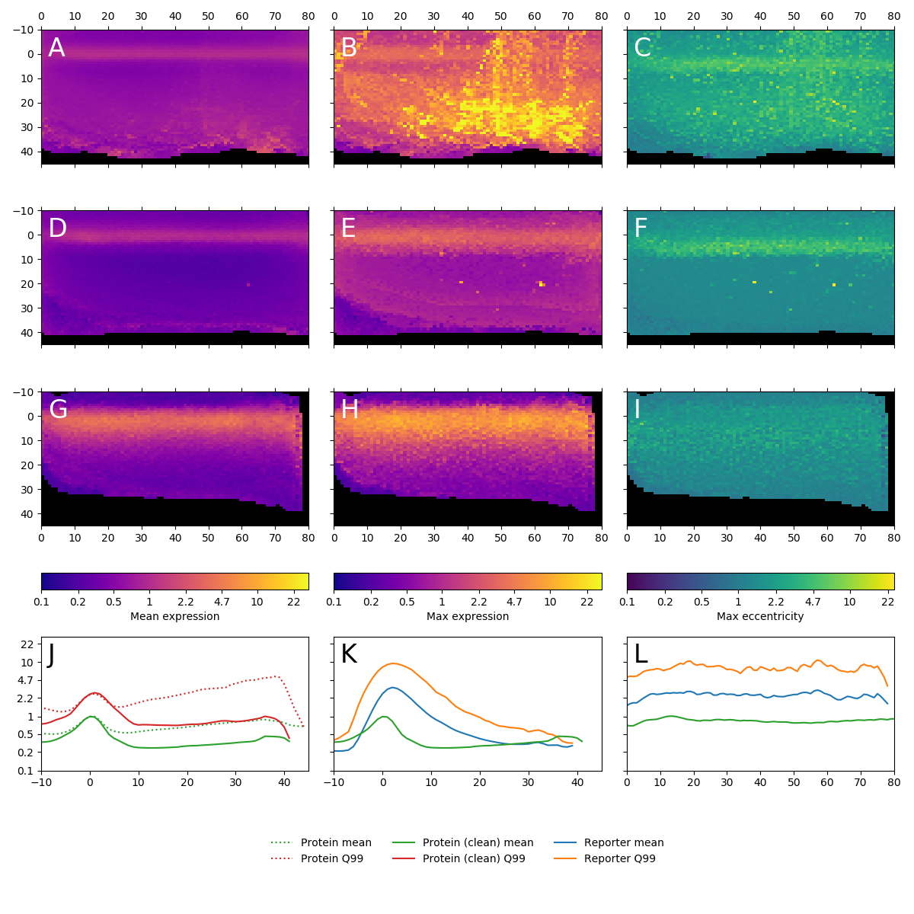

# Figure 2
### Expression pattern of Atonal

**(A)** mean intensity projection of Ato protein levels onto 80x55 grid, color scale is logarithmic, blue is low, yellow is high, spatial coordinates are expressed in units of mean nucleus diamater for each sample, x-axis (D-V) originates at the disc edge, y-axis (A-P) originates at the morphogenetic furrow (maximum of Ato expression). Data combined from all imaged discs. **(B)** maximum intensity projection of Ato protein levels. **(C)** maximum intensity projection of Ato protein "eccentricity", defined as a ratio between level in a particular cell and its immediate neighbors in 3-dimensional space. **(D-F)** mean intensity projection (**D**), maximum intensity projection (**E**) and eccentricity (**F**) of Ato protein from p[ACMAN] BAC-derived samples (*CG31176*, *beat-IIIc*, *king-tubby*, *lola-P*, *nmo*, *sNPF*, *Vn*, *Fas2*, *siz*). **(G-I)** mean intensity projection (**G**), maximum intensity projection (**H**) and eccentricity (**I**) of *ato* transcriptional reporter.

---

