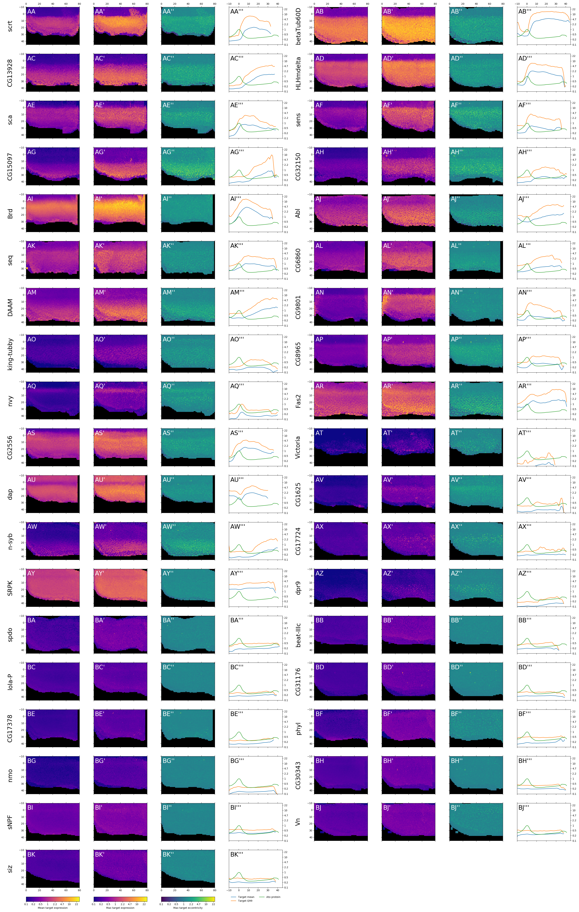

# Figure 3
### Expression patterns of Ato targets

**(AA-BK)** mean intensity projection of target gene expression levels onto 80x55 grid, color scale is logarithmic, blue is low, yellow is high, spatial coordinates are expressed in units of mean nucleus diamater for each sample, x-axis (D-V) originates at the disc edge, y-axis (A-P) originates at the morphogenetic furrow (maximum of Ato expression). **(AA'-BK')** maximum intensity projection of target gene expression levels. **(AA''-BK'')** maximum intensity projection of target gene "eccentricity", defined as a ratio between expression level in a particular cell and its immediate neighbors in 3-dimensional space. **(AA'''-BK''')**  expression profile of target genes, green - Ato protein expression, blue - mean target gene expression, orange - 99th percentile of target gene expression.

---

