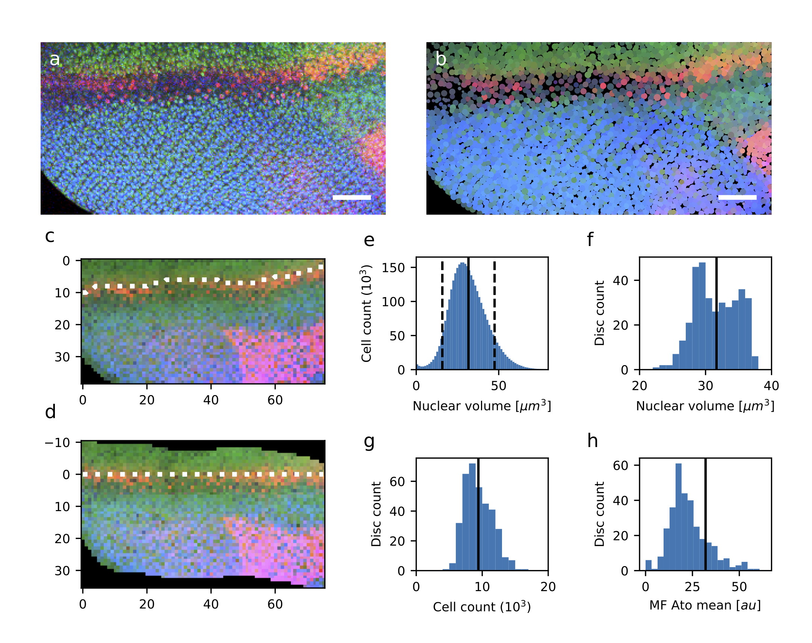

# Single-cell resolution view of the transcriptional landscape of developing *Drosophila* eye.

[Radoslaw Kamil Ejsmont](https://github.com/rejsmont)1, 2, 3, [Grace Houser](https://github.com/Grace-Houser)1, Natalia Mora Garcia1, 2, Sara Fonseca Topp1, Natalia Danda1, Agnes Wong-Chung1, Bassem A. Hassan1, 2, ✉
---
1 Institut du Cerveau et de la Moelle Epinière (ICM) - Hôpital Pitié-Salpêtrière, Sorbonne Université, Inserm, CNRS, Paris, France

2 VIB Center for the Biology of Disease, VIB, Leuven, Belgium

3 Current address: Center for Research and Interdisciplinarity (CRI), Paris, France, e-mail: [radoslaw.ejsmont@cri-research.org](mailto:radoslaw.ejsmont@cri-research.org)

✉ Corresponding author, e-mail: [bassem.hassan@icm-institute.org](mailto:bassem.hassan@icm-institute.org)

---

Abstract
========

Here, we present a novel approach for in situ quantification of gene
expression in a developing tissue. We created a pipeline that combines
computational prediction of transcription factor targets, fluorescent
reporter imaging, state-of-the-art image analysis, and automated
cell-type identification. We demonstrate the feasibility of our approach
by applying it to identify the sequence of quantitative changes in gene
expression which govern the development of the *Drosophila* neural
retina. We analyze the targets of Ato, a transcription factor that
controls the transition from eye disc intermediate cell to R8
photoreceptor neurons. We utilized recombineering and genomic
engineering to tag all predicted Ato targets with novel transcriptional
reporters. These reporters allow us to follow the expression of both
regulator and regulated genes to accurately quantify their expression
levels in individual cells. We developed a complete computational
pipeline to identify all nuclei in the eye discs and detect different
states of cells as they progress through differentiation. Based on
detailed gene expression analysis, we identify genes likely to be direct
Ato targets and get an insight into how gene expression changes drive
the specification of R8 photoreceptors.

Introduction
============

Animal development is a complex process in which a single cell gives
rise to a complex, multicellular organism. This process involves
divisions, migration, differentiation, and death. Cellular
differentiation is a multi-step process, where a cell faces subsequent
decisions progressively defining its terminal fate. Each defining
transition that a cell experiences, during development, is regulated by
key transcription factors. The discovery of many transcription factor
families and/or their relevance is credited to the powerful model system
*Drosophila melanogaster*. The complex genetic interactions, involved in
cellular differentiation, require precise spatiotemporal control of gene
expression. Gene expression can be directly quantified on both the
protein and mRNA level. Protein-based methods include traditional
western blotting and quantitative mass spectrometry that enables
genome-wide analysis[1](#Miyagi2007).
Measurements of gene activity are more commonly assayed on the messenger
RNA level using quantitative
PCR[2](#Wang1989), microarray
analysis[3](#Schena1995), and
next-generation
sequencing[4](#Nagalakshmi2008). Most direct
methods, of gene expression quantification, require isolation of protein
or mRNA from cells. This task is laborious and results in loss of
spatial and temporal resolution. The spatial resolution limitations of
these methods can be overcome using the fluorescent in situ
hybridization (FISH) technique. FISH can be applied to gather
quantitative gene expression data at a single-cell resolution and
below[5](#LuengoHendriks2006). However,
relative expression levels can hardly be compared between different
genes due to varying affinities of in situ probes. Single-molecule
fluorescent in situ hybridization (smFISH) addresses this issue by
quantifying the number of objects (mRNA molecules), instead of the gross
fluorescent signal per
cell[6](Femino1998),[7](Ray2008). While this
technique provides absolute quantification of gene expression, it cannot
be applied to living cells and requires very high-resolution imaging.
Therefore this technique limits the number of cells in which mRNAs can
be simultaneously quantified. The difficulties in the direct
quantitative detection of mRNA in the developing cells led to the
emergence of indirect methods that use various reporters as a proxy.

Indirect methods of gene expression quantification usually involve
placing a reporter under the control of a gene's promoter. This is
followed by the detection of the reporter through biochemical assays,
enzymatic reactions, or fluorescence. These methods mostly rely on
tissue imaging and therefore provide very good spatial data. The
Gal4/UAS binary expression system was most commonly used to create
enhancer traps[8](#Brand1993) and
visualize gene expression. The expression of various reporter proteins,
under the transcriptional control of the yeast upstream activating
sequence recognized by Gal4, provided means for monitoring gene
expression in a tissue-specific or temporarily triggered
manner[9](#Yeh1995). However, this
method is not quantitative due to signal amplification, caused by the
Gal4 transcription factor. An interesting method has been specifically
developed to directly assay mRNA levels in living cells. A combination
of the MS2 phage coat protein fused to a fluorescent protein and an mRNA
carrying MS2 binding sites enables direct visualization of transcripts
in cells and
tissues[10](#Johansson1997),[11](#Bertrand1998). While
powerful, this technique is quantitative only in combination with
single-molecule imaging, thus suffers from similar issues as smFISH.
There is a clear window of opportunity for improvement in how we are
currently collecting and analyzing gene expression data. Improvements in
this field will enhance our understanding of animal development, by
allowing researchers to collect larger more meaningful datasets.

The formation of the crystalline neural retina in the fruit fly
*Drosophila melanogaster* has long been used as a powerful model to
study the genetic control of cellular differentiation. The fly neural
retina consists of around 800 unit eyes or ommatidia, each containing 8
photoreceptor cells named R1-R8. The sequence of events in *Drosophila*
retinal differentiation is controlled by three structurally and
functionally conserved transcription factors called Eyeless/Pax6 (Ey),
Atonal (Ato) and Senseless (Sens). The high functional conservation,
across animal species for these key transcription factors, suggests that
observations obtained in *Drosophila* likely have relevance for the
understanding of similar processes in mammalian systems.

*Eyeless* is the primary control switch for eye development. Ectopic
expression of *Ey* in various epithelial primordia, the tissue in its
earliest stage of development, leads to the formation of eye structures
on *Drosophila* wings, legs, and
antennae[12](#Halder1995). Its
functional role in the control of eye development is conserved in the
animal world[13](#Quiring1994). While
Eyeless triggers the development of the eye, Ato governs neuronal cell
fate specification in multiple *Drosophila* sensory organs including
olfactory[14](#Dong2002) and
auditory[15](#Jarman1993) organs, and
the eye[16](#Jarman1994). In the eye,
Ato is required for the selection of the R8 photoreceptor cell, which
later recruits the remaining seven photoreceptor neurons to form the
ommatidium. Thus, in *ato* mutants, none of the photoreceptors
differentiate and the neural retina fails to form. Ato belongs to the
basic helix-loop-helix (bHLH) gene family. Together with the generally
expressed bHLH cofactor Daughterless/E12 it forms a heterodimer and acts
as a transcription factor. Target genes of Ato include *senseless*
(*sens*), *fasciclin 2* (*Fas2*), *dacapo* (*dap*) and *Down syndrome
cell adhesion molecule*
(*Dscam*)[17](#Aerts2010). Senseless
is a target of Ato required for maintenance of the acquired neural cell
fate. Sens together with another transcription factor called Rough (Ro)
forms a bistable negative-feedback loop that allows the neural precursor
cell to acquire and lock in its terminal R8
fate[18](#Pepple2008). Therefore, these
key transcription factors, mentioned, carry most of the weight when it
comes to eye development.

The genes described above, which together are key players of the
photoreceptor specification network, have been identified either in
genetic screens[19](#Melicharek2008),[20](#Pepple2007),
computationally[17](#Aerts2010) or in
chromatin immunoprecipitation (ChIP-chip / ChIP-seq)
experiments[21](#Celniker2009). These
methods provide insight into the identification and roles of key genes
in this complex network. However, data originating from such screens is
largely biased. Genetic screens, powerful in that they provide *in vivo*
data, are laborious and limited in the number of network members they
reveal. Computational screens identify potential members of the network
by searching for the enrichment of a motif, specific for a particular
transcription factor in the genome. Target genes are identified based on
their vicinity to the regulatory region. Target gene lists, produced
computationally, contain both false-positives and false-negatives. The
potential targets identified computationally need to be confirmed
experimentally. The ChIP-chip and ChIP-seq experiments provide the most
direct evidence of transcription factor binding, but they require a very
large amount of material and high-quality antibodies against analyzed
transcription factors. Additionally, tissue-specific ChIP involves
laborious preparation of the analyzed tissue. Both ChIP-based and
computational methods focus on the identification of enhancer regions.
Therefore, it remains unknown if and how the overall expression of a
potential target is influenced by the transcription factor.

Despite decades of research, only a basic and non-quantitative outline
of the gene regulatory network promoting neural cell specification in
the *Drosophila* retina is available. How this network is initiated and
modified as cells transition through successive states of
differentiation is essentially unknown. Equally unknown is how the
activity of transcription factors acting as binary switches of cell
fate, such as Ato, is translated into a spatiotemporally patterned
expression of target genes. Here, we present a novel approach to
quantify the expression of transcription factors and their targets. We
combine computational target gene predictions with high-resolution
imaging of genetically encoded reporters to collect single-cell
resolution data in the developing retina.

Results
=======

## Selection of Ato target genes for imaging

We developed a novel pipeline ([Fig. 1](#Fig_1))] to address issues with the
insufficient resolution of classical gene expression data. The
expression of Ato and its targets is captured at high dynamic range and
resolution by quantitative imaging of the tagged alleles. Focusing on
Ato, we computationally predicted 92 putative targets (including *ato*
itself) in the eye disc using i-cisTarget[22](Herrmann2012).
For each predicted target, we identified available genomic clones from FlyFos
(36) and p\[ACMAN\] (49) genomic
libraries[23](#Ejsmont2009),[24](#Venken2009) and
tagged each with a T2A-Venus transcriptional reporter ([Supplementary
Fig. 1](#Fig_S1)). All tagged fosmids and 10 BACs were selected for transgenesis
([Supplementary Table 1](#Tab_S1)). We prioritized transgenesis of target genes
that are co-regulated by other members of eye and retina specification
gene regulatory networks, namely by Ey and Sens. In total, we
successfully obtained transgenic lines for 38 Ato targets. The
transgenesis for 8 tagged targets (7 FlyFos-based and 1
p\[ACMAN\]-based) failed to produce stable lines. In addition, we found
that the integrity of 6 p\[ACMAN\]-based transgenes had been compromised
during transgenesis. For the visualization of Ato protein, we created a
mCherry-tagged allele *in situ*, using the IMAGO
technique[25](Choi2009). The
successfully obtained reporter transgenic lines were combined with the
Ato\[mCherry\] line for imaging.

## Nuclei segmentation and registration

The first hurdle to single-cell quantification of gene expression in
situ is the effective segmentation of individual cells in dense tissues.
To overcome this hurdle, we developed an efficient nuclear segmentation
algorithm ([Supplementary Fig. 2](#Fig_S2)). We imaged expression of
Ato\[mCherry\] and 38 target gene transcriptional reporters
in the eye discs dissected
from wandering third instar larvae. We segmented individual nuclei from
each confocal stack using DAPI staining as a nuclear marker. In further
analysis, we represented each nucleus as a sphere with a volume equal to
that measured from the original image. The signal intensity for each
nucleus was measured as the mean photon count from the whole nuclear
volume. Our segmentation algorithm sufficiently identified individual
Ato-expressing R8 nuclei, despite being based solely on the DAPI
staining ([Fig. 2ab](#Fig_2)). To facilitate image registration,
we created a disc
coordinate system. This system is based on the mean diameter of nuclei
in each sample, their position relative to the disc edge, and the line
of maximum Ato expression in the morphogenetic furrow (MF) ([Fig. 2cd](#Fig_2)
and [Supplementary Fig. 3](#Fig_S3)).
From 389 imaged discs we obtained over 3.4
million nuclei. However, approximately 21% of nuclei were excluded from
analysis because they had a volume deviating from the sample mean by
more than 50%. This deviation was likely a result of over- or
under-segmentation. The mean nuclear volume of \~31µm3, calculated
from our data ([Fig. 2e](#Fig_2)), is on the same order of magnitude as those
measured by others[26](#Maul1977),[27](#Puah2017).
The nuclear volume was relatively consistent across imaged discs, with
the sample mean ranging from 22-38µm3 ([Fig. 2f](#Fig_2)).
The number of nuclei
in the discs ([Fig. 2g](#Fig_2)) varied between 5 and 17 thousand,
depending on the disc
age, and was consistent with the number of nuclei in the developing fly
retina[28](#Kumar2012).
Finally, we measured the mean Ato\[mCherry\] signal intensity in the
nuclei along the MF for each sample ([Fig. 2h](#Fig_2)).
The large variability
(\~90% of samples fall into values between 10 and 50) was expected. The
observed variability is likely due to differences in fluorophore
degradation during sample processing (dissection, mounting), as well as
the time between sample mounting and imaging (ranging from 1 to 15
hours). To account for differences in fluorescence intensity between
samples, we normalized measured intensities of Ato\[mCherry\] and the
T2A-Venus transcriptional reporters to the mean intensity of
Ato\[mCherry\] along the MF. For each nucleus, we computed the following
parameters: xyz position in disc coordinate system; normalized
intensities of Ato\[mCherry\], T2A-Venus and DAPI; and the prominence of
Ato\[mCherry\] and T2A-Venus intensities (the ratio between signal
intensity for a particular nucleus, and that of its 26 nearest
neighbors). In summary, we obtained putative Ato target gene expression
data from almost 2.7 million individually segmented eye disc nuclei.

## Expression of Ato and its targets in the eye disc

With single nuclei data in hand, we sought to understand the
relationships between Ato expression and that of its potential targets.
To this end, we combined Ato\[mCherry\] expression data from all samples
and found that our tagged protein recapitulates Ato expression pattern
very well. Ato is first expressed by most cells (except the peripodial
membrane) in a narrow band along the MF ([Fig. 3a](#Fig_3)), later however its
expression gets resolved only to R8 photoreceptors posterior to the MF
([Fig. 3b](#Fig_3)). The expression of the *ato* transcriptional reporter follows
a similar pattern and is higher in the R8s. However, it\'s detectable
much further posterior to the furrow ([Fig. 3ce](#Fig_3)), especially in the R8
photoreceptors ([Supplementary Fig. 4](#Fig_S4)), and the prominence of expression
in the R8s is lower for mRNA than protein ([Fig. 3bd](#Fig_3)). The observed
persistence of ato mRNA far beyond the MF supports the previously
reported presence of a phosphorylated form of Ato in late
R8s[29](#Quan2016). Along the D-V
axis, we observed no significant variation in Ato levels, except for
\~25% (protein) and \~33% (reporter) lower expression on the disc edges
([Fig. 3f](#Fig_3)). In samples based on the FlyFos genomic clones we found,
especially in the discs with high MF progression, strong expression of
3xP3-dsRed FlyFos selectable marker in the posterior of the disc, the
optic nerve, and on the disc surface. This signal did not overlap with
the expression domain of Ato and was easily distinguishable from the
Ato\[mCherry\] signal ([Supplementary Fig. 4](#Fig_S4)). In accordance with these
observations, both the Ato\[mCherry\] allele and the *ato*
transcriptional reporter recapitulated the known features of Ato
expression.

We captured expression data of comparable detail for the predicted Ato
target genes ([Supplementary Fig. 5](#Fig_S5)). Most (27) genes were expressed in
the eye disc. The expressed genes fall into four categories
([Supplementary Table 2](#Tab_S2)). The first category contains 12 genes whose
expression starts within the MF. This group is enriched (6/12) for genes
involved in the Notch signaling pathway. The nine genes in the second
category are expressed slightly posterior to the MF. Four genes that
belong to the third category are expressed posterior to the MF. The last
category comprises genes expressed both anterior and posterior to the MF
(*dacapo*, *SRPK*). We found almost ubiquitous expression of *dacapo*
(*dap*) reporter surprising as its expression specific to R2/R5
precursors was previously well
described[28](#Sukhanova2007). We suspect
that the upstream sequence of the fosmid carrying the *dap* reporter
(\~3kb) is insufficient to recapitulate the native expression pattern,
and therefore we excluded *dap* from the further analysis. The
expression of five target genes was not detected, including *sanpodo*
(*spdo*), *phyllopod* (*phyl*), *CG31176*, *CG17378*, and *CG30343*.
Lack of the expression of *phyl* is clearly contradicted by
others[30](#Chang1995),[31](#Dickson1995), indicating
either damage to the fosmid carrying the reporter or the lack of
regulatory elements necessary for eye disc expression of *phyl* in that
fosmid. The gross analysis of putative Ato targets allowed us to
identify which genes are more likely to be regulated by Ato. This
includes genes that are expressed within, or in the proximity of the MF.
However, a closer look at how the expression varies in different cell
types is essential to draw any conclusions.

## Classification of cell types in the Ato expression domain

We wondered whether the volume and precision of our dataset would allow
the classification of cell state transitions during differentiation.
Having detailed single-cell resolution Ato expression data from hundreds
of samples, we classified cells based on their position along the
anterior-posterior (A-P) axis, Ato expression level, and its prominence.
We expected to primarily identify at least four classes of cells: cells
anterior to the furrow (Pre-MF), Ato-expressing cells in the furrow
(MF-medium), Ato-expressing R8 photoreceptors posterior to the MF (R8)
and the remaining cells posterior to the furrow (post-MF). We sought
that the differences in Ato expression and prominence in these classes
would be sufficient for clustering. Surprisingly, our clustering
algorithm failed to identify these classes (classifying some cells in
the MF as cells anterior to the MF or as R8s) unless the number of
clusters was increased to six ([Figure 4ab](#Fig_4)). The two additional clusters
contained MF nuclei that do not express Ato (MF-low) and MF cells with
high Ato expression and prominence (MF-high). The former class contains
the peripodial membrane cells, while the latter we have attributed to
the Ato-positive cells forming intermediate and equivalent groups. The
A-P extent of each cluster is summarized in [Supplementary Table 3](#Tab_S3). The
expression level of Ato is the highest in the MF-high class, followed by
the R8 and the MF-medium classes. The prominence of Ato expression is
the highest in the R8 class, followed by the MF-high class ([Figure 4c](#Fig_4)).
Mean position, Ato expression, and prominence in each class are
consistent across all analyzed samples, with the largest variability in
the pre-MF and post-MF classes ([Figure 4d](#Fig_4)). The mean number of segmented
nuclei in each class varies between 5904±1517 (\~69%) in the post-MF
class, 1322±831 (\~16%) in the pre-MF, 623±209 (\~7%) in the MF-medium,
378±172 (\~5%) in the MF-Low, 189±61 (\~2%) in MF-High and 92±23 (\~1%)
in the R8 classes ([Figure 4e](#Fig_4)). The expression of Ato in the R8 remains
relatively high up to six rows posterior to the MF, therefore yielding
\~15 Ato-positive R8 photoreceptors per row of cells. Given that R8
cells appear every second row in our coordinate system, the number of
R8s selected during one cycle is approximately 30, which is consistent
with the literature[27](#Kumar2012)
and manual examination of our images. Consequently, the number of cells
in the intermediate and equivalent groups should equal \~450 cells
versus \~189 cells that we attributed to the MF-high class. Some cells
from intermediate and equivalent groups were therefore assigned to the
MF-medium class due to lower Ato levels or lower Ato prominence,
suggesting high variability of the Ato protein levels during the initial
steps of R8 specification. This classification system allowed us to
describe how the target gene expression changes during the R8
specification.

## Expression of predicted Ato targets during R8 specification

To identify which of the predicted Ato targets have expression profiles
related to Ato, we looked at their expression levels in different cell
classes and at their expression profiles along the A-P axis ([Figure 5a](#Fig_5),
[Supplementary Figure 6](#Fig_S6)). We found that ten genes follow the levels of
Ato quite strongly, with the expression raising between MF-medium,
MF-high and R8 classes. Expression of eight of these genes is the
highest in the Ato-positive R8 cells, the remaining two genes (*Brd* and
*E(spl)mδ-HLH*) are expressed more in the Ato-negative cells immediately
posterior to the furrow. Additional two genes (*CG13928* and *Lrch*)
also follow Ato levels, however to a much lesser extent, and with much
shallower expression gradient within the MF. The *SR Protein Kinase*
(*SRPK*) is expressed at high levels throughout the disc, though higher
in the MF-high and the R8 cells. Among the genes that do not clearly
respond to the varying Ato levels, the expression of three (*βTub60D,*
*rau*, and *scrt*) onsets in MF proximity, with the highest levels in
Ato-negative cells. Four genes (*Abl*, *CG17724*, *CG32150, DAAM*) do
not exhibit differential expression in the Ato-positive cells. Five
genes were not expressed in the proximity of the furrow. In order to
achieve better insight into the regulation of putative targets, we
performed Ato ChIP-seq in the eye discs. We compared the upregulation of
these genes in cells with high (MF-high, R8) and low (Pre-MF, MF-Low,
Post-MF) Ato levels, to the Ato binding data from ChIP-seq ([Fig 5bcd](#Fig_5)).
Ato binds strongly enhancers of two (*ato*, *nvy*) out of six most
upregulated genes (*ato*, *CG9801*, *nvy*, *sca*, *CG2556*, *sens*),
three are bound moderately (*sens*, *CG2556*, *sca*). Exceptionally
strong binding of *nervy* (*nvy*) by Ato is not reflected in our
expression data. Enhancers of *Lrch*, a weakly upregulated gene, were
moderately bound by Ato. The binding of *CG9801* enhancers was not
supported by ChIP-seq data. Interestingly, we found ChIP peaks for genes
not expressed in the MF (*dpr9*), or those that appear to be invariant
to the Ato levels (*CG32150*, *DAAM*, *scrt*). Surprisingly, we did not
find ChIP-seq peaks for six genes upregulated in Ato-positive cells. We
found a correlation (ρ=0.94, p=4.14E-04, excluding *nvy* as an outlier)
between ChIP and our imaging data for the genes found in both datasets.
Based on the expression data in different classes and the enrichment of
*Ato* binding sites in the gene vicinity (based on the i-cisTarget
analysis), we propose that 13 out of 31 analyzed genes (*ato*, *Brd*,
*CG2556*, *CG9801*, *E(spl)mδ-HLH*, *Fas2*, *nvy*, *sca*, *sens*, *seq*,
*CG13928*, *Lrch*, and *SRPK*) are immediate and direct targets of *Ato*
in the eye disc. Our data on five genes (*CG31176*, *DAAM*, *dila*,
*rau*, and *spdo*) contradicts previous
predictions[17](#Aerts2010). The
expression of these genes in the MF area is close to our detection
threshold, therefore we can neither confirm nor exclude these genes as
Ato targets.

Discussion
==========

The methods to study developmental processes at a single cell level has
long been a subject of intense technology development. Single-cell RNA
sequencing in combination with clustering and data mining tools, such as
SCENIC[33](#Aibar2017) and
SCope[34](#Davie2018) enable
identification of cell types and states that cells transition through
during differentiation. scRNA-seq, while providing a quantitative
whole-transcriptome view at the level of individual cells, yields data
of limited dynamic range and low signal to noise
ratio[35](#Hicks2018). Complex sample
preparation and the desire to maximize sequencing depth limit the number
of analyzed cells in most developmental samples, from *Drosophila*, to
several thousand (rarely exceeding 20k). As a consequence, the
resolution of cell-type identification using scRNAseq is low. Mapping
scRNA-seq data onto FISH
datasets[36](#Karaiskos2017),[37](#Zhu2018) introduces
spatial dimensions to the single-cell transcriptional analysis. However,
due to limitations of the scRNAseq, it enables only a rough estimation
of the tissue regions that the individual cells originate from.

Our approach enables large scale quantitative gene expression analysis
(on the level of the TF targetome) at single-cell resolution. This
approach is done on the whole tissue level, with very high sensitivity
and dynamic range, and while preserving spatial information. Thanks to
whole tissue imaging, we are able to gather gene expression data from
millions of cells. We have both spatial information as well as the
precise measurements of expression levels for the transcription factor
driving the studied developmental process. Thus, our approach enables us
to identify transient states that cells progress through
differentiation. Unlike in approaches relying on vast amounts of noisy
full transcriptome data, we show that precise analysis of the expression
of a single gene is sufficient to identify these states. Together with
cell-type identification, our unique disc coordinate system
(Supplementary Fig. 4) enabled identification of cells with the same
properties in different samples. Therefore, it allowed us to assert
expression levels for all assayed genes during differentiation. With
expression data on both the transcription factor and its putative target
genes, we were able to find a spatio-temporal (as differentiation
progresses as a wavefront along the A-P axis, the distance from the MF
defines the \"developmental age\" of each cell) relationship between the
levels of Ato and the expression of these genes.

Based on this relationship, we were able to identify 13 genes as likely
direct Ato targets. Five of these genes (*ato*, *E(Spl)*, *Fas2*, *sca*,
*sens*) were previously identified by others using both computational
approaches and enhancer reporter
assays[17](#Aerts2010). We provided
supporting evidence for four genes (*CG2556*, *CG9801*, *nvy*, *SRPK*)
that were previously only predicted
computationally[17](#Aerts2010) and
identified three new targets (*Brd*, *seq*, *CG13928*). Interestingly,
none of the direct Ato targets we identified here encode for structural
or neurofunctional proteins, but rather for members of the Notch or EGFR
signaling pathways and other regulators of gene expression. This
suggests that Ato regulates only the switch of cell fate, and the
downstream differentiation program is executed through changes in the
signaling state of the cell and fine-tuned through specific
transcription factors such as *sens* and *seq*.

While the method presented here has been specifically tailored to the
analysis of gene expression in the developing Drosophila retina, it is
generalizable. The expression of any developmental transcription factor
can be used as a landmark, in a similar fashion to how we used the
expression of Atonal. Depending on how differentiation progresses in a
tissue of interest, different coordinate systems can be created, for
example, a radial coordinate system could be suitable for the analysis
in the inner proliferation center (IPC) of developing Drosophila
brain[38](#Mora2018). With the
advances in tissue culture and imaging techniques, such as the
lightsheet
microscopy[39--41](#Huisken2004), our
approach could be implemented in living tissues. Deep learning-based
analysis[42](#Weigert2018) could further
improve the image segmentation and cell-type classification. This could
help in better assess genes expressed at very low levels.

References
==========

1. Miyagi, M. & Rao, K. C. S. Proteolytic 18O-labeling strategies for
quantitative proteomics. *Mass Spectrom. Rev.* **26**, 121--136
(2007).

2. Wang, A. M., Doyle, M. V. & Mark, D. F. Quantitation of mRNA by the
polymerase chain reaction. *Proc. Natl. Acad. Sci. U. S. A.* **86**,
9717--9721 (1989).

3. Schena, M., Shalon, D., Davis, R. W. & Brown, P. O. Quantitative
monitoring of gene expression patterns with a complementary DNA
microarray. *Science* **270**, 467--470
(1995).

4. Nagalakshmi, U. *et al.* The transcriptional landscape of the yeast
genome defined by RNA sequencing. *Science* **320**, 1344--1349
(2008).

5. Luengo Hendriks, C. L. *et al.* Three-dimensional morphology and
gene expression in the Drosophila blastoderm at cellular resolution I:
data acquisition pipeline. *Genome Biol.* **7**, R123
(2006).

6. Femino, A. M., Fay, F. S., Fogarty, K. & Singer, R. H. Visualization
of single RNA transcripts in situ. *Science* **280**, 585--590
(1998).

7. Raj, A., van den Bogaard, P., Rifkin, S. A., van Oudenaarden, A. &
Tyagi, S. Imaging individual mRNA molecules using multiple singly
labeled probes. *Nat. Methods* **5**, 877--879
(2008).

8. Brand, A. H. & Perrimon, N. Targeted gene expression as a means of
altering cell fates and generating dominant phenotypes. *Dev. Camb.
Engl.* **118**, 401--415
(1993).

9. Yeh, E., Gustafson, K. & Boulianne, G. L. Green fluorescent protein
as a vital marker and reporter of gene expression in Drosophila. *Proc.
Natl. Acad. Sci. U. S. A.* **92**, 7036--7040
(1995).

10. Johansson, H. E., Liljas, L. & Uhlenbeck, O. C. RNA Recognition by
the MS2 Phage Coat Protein. *Semin. Virol.* **8**, 176--185
(1997).

11. Bertrand, E. *et al.* Localization of ASH1 mRNA Particles in Living
Yeast. *Mol. Cell* **2**, 437--445
(1998).

12. Halder, G., Callaerts, P. & Gehring, W. J. Induction of ectopic
eyes by targeted expression of the eyeless gene in Drosophila. *Science* **267**, 1788--1792 (1995).

13. Quiring, R., Walldorf, U., Kloter, U. & Gehring, W. J. Homology of
the eyeless gene of Drosophila to the Small eye gene in mice and
Aniridia in humans. *Science* **265**, 785--789
(1994).

14. Dong, P. D. S., Dicks, J. S. & Panganiban, G. Distal-less and
homothorax regulate multiple targets to pattern the Drosophila antenna. *Dev. Camb. Engl.* **129**, 1967--1974
(2002).

15. Jarman, A. P., Grau, Y., Jan, L. Y. & Jan, Y. N. atonal is a
proneural gene that directs chordotonal organ formation in the
Drosophila peripheral nervous system. *Cell* **73**, 1307--1321
(1993).

16. Jarman, A. P., Grell, E. H., Ackerman, L., Jan, L. Y. & Jan, Y. N.
Atonal is the proneural gene for Drosophila photoreceptors. *Nature* **369**, 398--400 (1994).

17. Aerts, S. *et al.* Robust target gene discovery through
transcriptome perturbations and genome-wide enhancer predictions in
Drosophila uncovers a regulatory basis for sensory specification. *PLoS
Biol.* **8**, e1000435
(2010).

18. Pepple, K. L. *et al.* Two-step selection of a single R8
photoreceptor: a bistable loop between senseless and rough locks in R8
fate. *Dev. Camb. Engl.* **135**, 4071--4079
(2008).

19. Melicharek, D. *et al.* Identification of novel regulators of
atonal expression in the developing Drosophila retina. *Genetics* **180**, 2095--2110 (2008).

20. Pepple, K. L., Anderson, A. E., Frankfort, B. J. & Mardon, G. A
genetic screen in Drosophila for genes interacting with senseless during
neuronal development identifies the importin moleskin. *Genetics* **175**, 125--141 (2007).

21. Celniker, S. E. *et al.* Unlocking the secrets of the genome. *Nature* **459**, 927--930
(2009).

22. Ejsmont, R. K., Sarov, M., Winkler, S., Lipinski, K. A. & Tomancak,
P. A toolkit for high-throughput, cross-species gene engineering in
Drosophila. *Nat. Methods* **6**, 435--437
(2009).

23. Venken, K. J. T. *et al.* Versatile P\[acman\] BAC libraries for
transgenesis studies in Drosophila  melanogaster. *Nat. Methods* **6**,
431--434 (2009).

24. Choi, C. M. *et al.* Conditional mutagenesis in Drosophila. *Science* **324**, 54
(2009).

25. Maul, G. & Deaven, L. Quantitative determination of nuclear pore
complexes in cycling cells with differing DNA content. *J. Cell Biol.* **73**, 748--760 (1977).

26. Puah, W. C., Chinta, R. & Wasser, M. Quantitative microscopy
uncovers ploidy changes during mitosis in live *Drosophila* embryos and
their effect on nuclear size. *Biol. Open* **6**, 390--401
(2017).

27. Kumar, J. P. Building an Ommatidium One Cell at a Time. *Dev. Dyn.
Off. Publ. Am. Assoc. Anat.* **241**, 136--149
(2012).

28. Sukhanova, M. J., Deb, D. K., Gordon, G. M., Matakatsu, M. T. & Du,
W. Proneural Basic Helix-Loop-Helix Proteins and Epidermal Growth Factor
Receptor Signaling Coordinately Regulate Cell Type Specification and cdk
Inhibitor Expression during Development. *Mol. Cell. Biol.* **27**,
2987--2996 (2007).

29. Quan, X.-J. *et al.* Post-translational Control of the Temporal
Dynamics of Transcription Factor Activity Regulates Neurogenesis. *Cell***164**, 460--475 (2016).

30. Chang, H. C. *et al.* phyllopod functions in the fate determination
of a subset of photoreceptors in Drosophila. *Cell* **80**, 463--472
(1995).

31. Dickson, B. J., Domínguez, M., van der Straten, A. & Hafen, E.
Control of Drosophila photoreceptor cell fates by phyllopod, a novel
nuclear protein acting downstream of the Raf kinase. *Cell* **80**,
453--462 (1995).

32. Jarman, A. P., Sun, Y., Jan, L. Y. & Jan, Y. N. Role of the
proneural gene, atonal, in formation of Drosophila chordotonal organs
and photoreceptors. *Development* **121**, 2019--2030
(1995).

33. Aibar, S. *et al.* SCENIC: Single-cell regulatory network inference
and clustering. *Nat. Methods* **14**, 1083--1086
(2017).

34. Davie, K. *et al.* A Single-Cell Transcriptome Atlas of the Aging
Drosophila Brain. *Cell* **174**, 982-998.e20
(2018).

35. Hicks, S. C., Townes, F. W., Teng, M. & Irizarry, R. A. Missing
data and technical variability in single-cell RNA-sequencing
experiments. *Biostat. Oxf. Engl.* **19**, 562--578
(2018).

36. Karaiskos, N. *et al.* The Drosophila embryo at single-cell
transcriptome resolution. *Science* **358**, 194--199
(2017).

37. Zhu, Q., Shah, S., Dries, R., Cai, L. & Yuan, G.-C. Identification
of spatially associated subpopulations by combining scRNA-seq and
sequential fluorescence in situ hybridization data. *Nat. Biotechnol.*
(2018).
doi:10.1038/nbt.4260

38. Mora, N. *et al.* A Temporal Transcriptional Switch Governs Stem
Cell Division, Neuronal Numbers, and Maintenance of Differentiation. *Dev. Cell* **45**, 53-66.e5
(2018).

39. Huisken, J., Swoger, J., Del Bene, F., Wittbrodt, J. & Stelzer, E.
H. K. Optical sectioning deep inside live embryos by selective plane
illumination microscopy. *Science* **305**, 1007--1009
(2004).

40. Chen, B.-C. *et al.* Lattice light-sheet microscopy: imaging
molecules to embryos at high spatiotemporal resolution. *Science* **346**, 1257998 (2014).

41. Vaadia, R. D. *et al.* Characterization of Proprioceptive System
Dynamics in Behaving Drosophila Larvae Using High-Speed Volumetric
Microscopy. *Curr. Biol. CB* **29**, 935-944.e4
(2019).

42. Weigert, M. *et al.* Content-aware image restoration: pushing the
limits of fluorescence microscopy. *Nat. Methods* **15**, 1090--1097
(2018).

43. Herrmann, C., Van de Sande, B., Potier, D. & Aerts, S. i-cisTarget:
an integrative genomics method for the prediction of regulatory features
and cis-regulatory modules. *Nucleic Acids Res.* **40**, e114
(2012).

44. Sarov, M. *et al.* A genome-wide resource for the analysis of
protein localisation in Drosophila. *eLife* **5**, e12068
(2016).

45. Ejsmont, R. K. *et al.* Recombination-mediated genetic engineering
of large genomic DNA transgenes. *Methods Mol. Biol. Clifton NJ* **772**, 445--458 (2011).

46. Ejsmont, R. A toolkit for visualization of patterns of gene
expression in live Drosophila embryos. (TU Dresden,
2011).

47. Groth, A. C., Fish, M., Nusse, R. & Calos, M. P. Construction of
transgenic Drosophila by using the site-specific integrase from phage
phiC31. *Genetics* **166**, 1775--1782
(2004).

48. Venken, K. J. T., He, Y., Hoskins, R. A. & Bellen, H. J.
P\[acman\]: a BAC transgenic platform for targeted insertion of large
DNA fragments in D. melanogaster. *Science* **314**, 1747--1751
(2006).

49. Sommer, C., Straehle, C., Köthe, U. & Hamprecht, F. A. Ilastik:
Interactive learning and segmentation toolkit. in *2011 IEEE
International Symposium on Biomedical Imaging: From Nano to Macro*
230--233 (2011).
doi:10.1109/ISBI.2011.5872394

50. Schindelin, J. *et al.* Fiji: an open-source platform for
biological-image analysis. *Nat. Methods* **9**, 676--682
(2012).

51. Arganda-Carreras, I. *et al.* Trainable Weka Segmentation: a
machine learning tool for microscopy pixel classification. *Bioinforma.
Oxf. Engl.* **33**, 2424--2426
(2017).

52. Ollion, J., Cochennec, J., Loll, F., Escudé, C. & Boudier, T.
TANGO: a generic tool for high-throughput 3D image analysis for studying
nuclear organization. *Bioinformatics* **29**, 1840--1841
(2013).

53. MacQueen, J. Some methods for classification and analysis of
multivariate observations. in (The Regents of the University of
California, 1967).

54. Ester, M., Kriegel, H.-P., Sander, J. & Xu, X. A Density-based
Algorithm for Discovering Clusters a Density-based Algorithm for
Discovering Clusters in Large Spatial Databases with Noise. in *Proceedings
of the Second International Conference on Knowledge
Discovery and Data Mining* 226--231 (AAAI Press,
1996).

55. Ward, J. H. Hierarchical Grouping to Optimize an Objective
Function. *J. Am. Stat. Assoc.* **58**, 236--244
(1963).

56. Pérez-Lluch, S. *et al.* Genome-wide chromatin occupancy analysis
reveals a role for ASH2 in transcriptional pausing. *Nucleic Acids Res.* **39**, 4628--4639 (2011).

Methods
=======

## Putative target gene predictions and construct design

The list of putative Ato target genes was generated using i-cisTarget
webtool[22](#Herrmann2012)
\([https://med.kuleuven.be/lcb/i-cisTarget](https://med.kuleuven.be/lcb/i-cisTarget)\).
We used the same lists of up-/downregulated genes in Ato gain or loss of
function, as in the original cisTargetX (predecessor of i-cisTarget)
publication[17](#Aerts2010). For each
putative target gene, a suitable fosmid or BAC has been found using the
TransGeneOmics
database[22](#Ejsmont2009),[44](#Sarov2016)
\([https://transgeneome.mpi-cbg.de](https://transgeneome.mpi-cbg.de)\).
Recombineering primers were automatically designed using the same
database. Fosmid clones were preferred over BACs. Clones with more
upstream than downstream sequence and shorter clones were prioritized.
The constructs for Ato[mCherry] knock-in were designed in CLC Main
Workbench
([https://www.qiagenbioinformatics.com/products/clc-main-workbench](https://www.qiagenbioinformatics.com/products/clc-main-workbench)).
The Sanger sequencing assembly and analysis, as well as primer design
for sample validation, was also performed in CLC Main Workbench.
Annotated BAC and plasmid sequences are available in the project GitHub
repository
([https://github.com/rejsmont/rdn-wdp-data](https://github.com/rejsmont/rdn-wdp-data)).

## Plasmids, Fosmids and BACs

Selected fosmids and BACs carrying putative Ato target genes were
C-terminally tagged with the
TagNG\[2xTY1-T2A-Venus-NLS-3xFLAG\][45](#Ejsmont2011)
as described in the liquid culture recombineering protocol[46](#Ejsmont2011b) \(Protocol 8 in the thesis; full text is available online from TU Dresden library
[https://nbn-resolving.org/urn:nbn:de:bsz:14-qucosa-66452](https://nbn-resolving.org/urn:nbn:de:bsz:14-qucosa-66452)\).
In short, chloramphenicol (Cm)-resistant bacteria carrying the genomic
constructs were transformed with temperature-sensitive (30ºC) pRedFlp4
plasmid that contains the homologous recombinase (Red operon) under
rhamnose (rha)-inducible promoter and the flippase under
anhydrotetracycline (aHT)-inducible promoter. Bacteria were cultured
overnight at 30ºC with Hygromycin (Hyg) and Cm selection. Fresh cultures
were inoculated from the overnight cultures, and the expression of the
Red operon was induced with rhamnose. After induction bacteria were
transformed with the PCR-amplified recombineering cassette. Recombinants
were selected in liquid culture at 30ºC under Cm+Hyg+Kan selection. The
saturated cultures were used to inoculate an overnight culture on medium
with Cm+Hyg+aHT at 30ºC to remove the FRT-flanked kanamycin selection
cassette. Finally, the last overnight cultures at 37ºC with Cm selection
were inoculated to remove the helper plasmid. Low salt LB (Sigma L3397)
was used as a medium for overnight cultures. Recovery after
electroporation was performed in the SOC medium (Sigma S1797). After the
last culture bacteria were plated on chloramphenicol (15µg/ml) LB-agar
plates and single colonies were selected and verified using a colony PCR
with TagT2A\_chk\_fwd (CGG AGA TGT GGA GGA GAA TC) and TagT2A\_chk\_fwd
(CTT GTC GTC GTC ATC CTT GT) primers. The same primers were used for
final construct verification by Sanger sequencing. The integrity of
fosmids and BACs was verified by *Xba*I fingerprinting.

The recombinase-mediated cassette exchange construct used to generate
the Ato[mCherry] allele (pattB-5\'ato-3\'ato-attB\_ato-mCherry) was based
on pattB-5\'ato-3\'ato-attB\_ato-eGFP plasmid (NM / Hassan Lab). mCherry
coding sequence was amplified from
pTagNG\[2xTY1-mCherry-3xFLAG\][45](#Ejsmont2011)
using XhoI-mCherry-fwd (`TGC GCC TCG AGG GCG GAT CTG GCG GAT CTG GCG GAT
CTA TGG TGA GCA AGG GCG AGG AGG`) and BsiWI-mCherry-rev (`GAA TTC ACG TAC
GTT ACT TGT ACA GCT CGT CCA TG`) primers and cloned into *Xho*I and
*Bsi*WI sites of the ato-eGFP plasmid.

## Fly stocks and husbandry

The flies carrying the *Ato[mCherry]* allele were generated using the
IMAGO technique[24](#Choi2009). The
pattB-5\'ato-3\'ato-attB\_ato-mCherry construct was injected into the
atow+ knock-in flies (*vas-phiC31;; atow+16-1/TM6c*, XQ / Hassan
Lab). F0 males were crossed to (*w;; TM3 / TM6c*) virgins. Selected
recombinants (*w;; Ato[mCherry] / TM3*) were used to establish a
homozygous stock used in the subsequent crosses. The 39 tagged fosmids
and BACs carrying putative Ato target genes (TG) were used for
PhiC37-mediated
transgenesis[47](#Groth2004) into the
VK00037[48](#Venken2006) landing site
flies (*y1, M{vas-int.Dm}ZH-2A, w&ast;; PBac{y+-attP-3B}VK00037*,
Bloomington 24872). Transformants were selected for *3xP3-dsRed*
(fosmids) or *w+* (BACs) and balanced with *CyO*. Male flies (*w/Y;
TG-Venus/CyO*) with either *w+* or *3xP3-dsRed* marker were crossed to
virgin females (*w; L/CyO; D/TM6C, Sb, Tb*). From this cross, male
progenies were selected (*w/Y; TG-Venus/CyO; +/TM6C, Sb, Tb*), and
crossed to virgin females (*w; L/CyO-GFP; Ato[mCherry]*). In the last
cross, male progenies with the genotype (*w/Y; TG-Venus/CyO-GFP;
Ato[mCherry]/TM6C, Sb, Tb*) were selected and crossed to virgin females
(*w;; Ato[mCherry]*). Third instar larvae were selected from this cross
(*w; TG-Venus/+; Ato[mCherry]*) and used for the imaging experiments.
Flies were raised in a temperature and humidity-controlled incubator at
25ºC on standard fly food.

## Sample preparation

After selecting the third instar larvae from the imaging cross, the
samples were prepared for imaging. Due to the nature of the native
fluorescent protein stability and intensity, it was crucial that samples
be imaged the same day they were prepared. Larval brain complexes (from
\~30 larvae) were dissected under a stereomicroscope. The larvae were
dissected in a shallow glass dish with 0.1 M phosphate-buffered saline
(PBS), using size 5 forceps and subsequently transferred to a 1.5 ml
tube of 0.1 M PBS, kept on ice. The dissections were performed within 30
minutes, followed directly by a fixation with 4% formaldehyde in PBS
supplemented with 0.3% TritonX (PBS-T) for 10 minutes. The brain
complexes were then rinsed with PBS-T, followed by 3 washes (5, 10, and
then 15 minutes). Following the washes, the brains were stained with
DAPI (Sigma Aldrich D9564, 1:50,000 in PBS-T) for 15 minutes. Following
staining, the brain complexes were washed (5 and then 10 minutes) in
PBS-T and then stored in PBS-T at 4ºC, for up to 3 hours. Using size 5
forceps and acupuncture needles, the eye-antennal imaginal discs (Figure
4) were dissected from the brain complexes and mounted on a charged
slide (\~ 20 discs). The tissue was covered with a thin layer of
mounting medium (2.5% DABCO in Mowiol® 4-88) and sealed under a \#1.5
coverslip with Fixogum (Marabu).

## Imaging

Individual eye discs were scanned at single-cell resolution with an
upright confocal microscope (Olympus FV1200) using a 40x 1.3 NA oil
immersion lens. Venus fluorescent signal, which is coupled to TG
expression, was captured using a 515 nm diode-pumped solid-state (DPSS)
laser (power 0.2µW; AOTF 65%). mCherry fluorescent signal, which is
coupled to Ato expression, was captured using a 559 nm DPSS laser (power
1.3µW; AOTF 65%). Venus and mCherry fluorescent signals were imaged
using a z-step of 0.3 µm, an image size of 1024 x 512 pixels, and with a
voxel size of 0.3 x 0.3 x 0.3 μm. GaAsP photomultipliers were used to
detect Venus and mCherry fluorescent signal. DAPI fluorescence signal
was captured using a 405 nm diode laser (power 1.3µW; AOTF 2.5%). DAPI
fluorescence signal was imaged using a z-step of 0.15 µm, an image size
of 2048 x 1024 pixels, and a voxel size (0.15 x 0.15 x 0.15 μm).
Conventional photomultiplier was used to detect DAPI fluorescent signal.
The DAPI channel was oversampled compared with the Venus and mCherry
channels because our segmentation algorithm requires a higher resolution
to distinguish between individual nuclei. The pixel dwell time was 10µs
for all channels. Each channel was scanned separately. Each eye disc
took approximately 3 hours to scan, 5-10 discs were scanned per session,
and longer wavelength channels were imaged first (mCherry, Venus and
DAPI) to reduce photodamage and photobleaching.

## Segmentation

The first step in the applied image segmentation processes was pixel
classification using the random forest machine learning approach. Nuclei
and background were manually marked using 2 labels (nucleus and
background) in the DAPI channel for one z-stack image (randomly selected
512 x 512 pixels window cropped from full-size image) from each imaging
session using Ilastik[49](#Sommer2011).
Custom Fiji[50](#Schindelin2012) plugins
([https://github.com/rejsmont/rdn-wdp](https://github.com/rejsmont/rdn-wdp))
utilizing WEKA[51](#ArgandaCarreras2017) and 3D
ImageJ Suite[52](#Ollion2013) were
developed for training and application of the classifier. The classifier
was trained based on several filters (Gaussian blur, derivatives,
Difference of Gaussian, Laplacian of Gaussian, Max of Hessian
eigenvalue, minimum, maximum, mean, median, and variance) with sigma
values between 1-8 pixels applied to the training images. Probability
maps generated by applying the classifier to each acquired stack were
used for the next steps in the segmentation.

The Difference of Gaussians (DoG) filter was applied to the nuclei
probability maps with sigma values of 8 and 5, followed by a local
maxima filter with 3 pixel radius. The nuclear binary mask (threshold
p\>0.2) and seeds from the DoG were used for the 3D watershed
segmentation. The results of the segmentation were stored as point
clouds in per-sample CSV files, together with imaging and segmentation
metadata stored in YAML files. Each sample was given a unique, random 6
alphanumeric character identifier. Segmentation was performed on the
ThinKing thin node cluster of the KU Leuven high-performance computing
center.

## Registration

To enable direct comparisons between different samples, sample
registration was performed using a custom python script (`analyze2`)
available from the data analysis repository
([https://github.com/rejsmont/rdn-wdp-python](https://github.com/rejsmont/rdn-wdp-python)).
First, nuclei were read from the point cloud CSV file. Nuclei that
differ from the sample mean by more than 50% were rejected. Coordinates
of each nucleus were scaled to a unit of mean nucleus diameter in the
sample. Rotation of each sample was automatically adjusted so that the
visible edge of the disc is on the left and the anterior of the disc is
at the top. The morphogenetic furrow (MF) was identified using the Max
of Hessian eigenvalue filter applied to the xyz projection of the
mCherry channel onto a 1-unit 2D grid. The intensities of each channel
were normalized to the mean intensity of mCherry along the MF. The
anterior-posterior (y) coordinates of the nuclei were aligned so that
the nuclei laying on the MF line have y coordinate equal to zero. For
each nucleus, 26 nearest neighbors were identified using a k-dimensional
tree (KD-tree). The prominence of mCherry and Venus signal was
calculated as a fraction of the value in the nucleus over the mean value
in k-26 neighbors. The normalized and registered values were stored in
per-sample CSV files and subsequently combined into a single CSV file.
13 samples with extremely low signal to noise ration or where the disc
morphology was distorted were excluded at this step.

## Cell-type classification

To determine the identity of cells in the MF area (-8\>y\>8) we
decided to cluster these cells based on their position along the A-P
axis (y), the expression level of Atonal protein (A), and the prominence
of Ato expression (PA). Due to the number of cells in our samples
(millions), simple linkage analysis is impossible due to huge memory
requirements. On the other hand, we found that the clustering approaches
designed to deal with large datasets (such as
K-means[53](#MacQueen1967) or
DBscan[54](#Ester1996) do not perform
well on datasets with smooth transitions between the clusters. As
changes of both Ato intensity and prominence are continuous is our data,
these approaches failed to correctly identify different stages of R8
specification. Faced with these restrictions, we sought to divide a big
problem of clustering millions of cells into multiple smaller ones. We
randomly selected sets of 20 samples and performed the linkage analysis,
using the Euclidean metric and the Ward variance minimization
algorithm[55](#Ward1963), on cells in
these samples. To recover clusters from linkage analysis we used the
maximum number of clusters as a criterion. We optimized this parameter
until the R8 cells were resolved in most samples, and found the optimal
number of clusters to be six. The random sample selection and clustering
have been repeated 1000 times to maximize sample coverage and
variability. To identify similar clusters from all the attempts we used
a custom clustering algorithm, similar to the K-means method, but
optimized to cluster centroids of a known number of clusters (see
`cluster_centroids` method in
[https://github.com/rejsmont/rdn-wdp-python/blob/master/analysis/clustering.py](https://github.com/rejsmont/rdn-wdp-python/blob/master/analysis/clustering.py)).
In short, first, centroids from a random clustering run are used as
seeds. Centroids from subsequent runs are iteratively added and the
homologous clusters are identified by the shortest Euclidean distance
from the seeds. Centroids of newly formed global clusters are used as
seeds in the next iteration. After all the samples have been included in
the computation, the computed global centroids become new seeds and the
whole process is repeated until the distance between the seeds from
current and the previous iteration is smaller than a threshold value
(1e-10). Subsequently, we selected cells from all samples that are close
(Euclidean distance of 1) to global cluster centroids to train a random
forest classifier that we then applied to all cells within the MF area.
Cell types corresponding to the clusters were identified as follows, in
order, removing the identified cluster from the pool: a cluster with the
highest Ato prominence was identified as \"R8\", a cluster with the
highest Ato expression was identified as \"MF High\", a cluster with the
highest A-P position was identified as Post-MF, a cluster with the
lowest A-P position was identified as Pre-MF, from the remaining
clusters, the one with the highest Ato expression was identified as \"MF
Medium\" and the one with the lowest, as \"MF Low\". Samples in which we
failed to recover cells that belong to all six clusters were removed
from further analysis. Finally, as in some samples we saw a number of
cells that were misclassified, we refined the cluster assignment using
A-P position as a discriminator; for example, cells classified as R8 but
close (within 2 cell diameters) to the furrow were reclassified as MF
High (see the `cleanup_clusters` method for details).

## Chromatin immunoprecipitation (ChIP)

800 eye-antennal discs were isolated from (*w; ato-GFP*) third-instar
larvae. Chromatin was immunoprecipitated using anti-GFP (ab290, Abcam)
antibody, purified and sequenced following previously published
protocols[56](#PerezLluch2011). Raw data of
eye-disc samples was deposited in the Gene Expression Omnibus (GEO)
database
([http://www.ncbi.nlm.nih.gov/projects/geo/](http://www.ncbi.nlm.nih.gov/projects/geo/))
with the accession number GSE110827.

## Data analysis, visualization, and statistics

Final analysis of the data, statistical analysis, and figure plotting
was done in Python. The code is available from the data analysis
repository
([https://github.com/rejsmont/rdn-wdp-python](https://github.com/rejsmont/rdn-wdp-python)).
All data figures were automatically generated (see the figure plotting
script for details
[https://github.com/rejsmont/rdn-wdp-python/blob/master/analysis/figures\_paper.py](https://github.com/rejsmont/rdn-wdp-python/blob/master/analysis/figures_paper.py)).
The gene expression patterns and prominence patterns ([Fig. 3](#Fig_3),
[Supplementary Fig. 3](#Fig_S3) and [5](#Fig_S5)) were plotted as xyz projection of the
respective values onto a 1-unit 2D grid. The mean projection was used
for the expression values and the max projection was used for the
prominence. The ChIP peak area ([Fig. 5c](#Fig_5)) was computed as a product of
the peak length (in bp) and the peak height. Expression fold change of
putative Ato targets ([Fig. 5d](#Fig_5)) was computed as a fraction of the mean
expression in the between Ato-high (MF-High and R8 classes) and Ato-low
cells (MF-Low, Pre-MF, and Post-MF). The standard error of the mean
(SEM) has been propagated accordingly. The significance of changes has
been tested using a two-sided unequal variance z-test with Bonferroni
correction. The correlation between expression fold change and the ChIP
peak area ([Fig. 5b](#Fig_5)) was assessed from the Pearson product-moment
correlation coefficient. P-values were derived from the linear
least-squares regression. The significance of gene expression changes
between different cell types ([Supplementary Fig. 6](#Fig_S6)) was tested using a
two-sided unequal variance z-test with Bonferroni correction.
Statistical significance was not computed for data points with mean
expression values lower than 0.2. Classification of genes into groups of
those that strongly or weakly follow the expression of Atonal, those
that do not and those that are not expressed in the furrow area was
performed manually, based on the significance of expression level
changes and the A-P expression profiles in different cell types.

Figures
=======

---

<small>
**Figure 1 - Experimental pipeline.** Our experimental pipeline starts
with the computational prediction of putative Ato targets. Each target
is then tagged with a nuclear fluorescent reporter. Tagged genomic
constructs are injected into fly embryos. Tagged target genes are
combined with the fluorescently labeled Ato allele in a series of
genetic crosses. Eye discs from third instar larvae are dissected and
imaged. Nuclei from each image are segmented. Discs are aligned along
the morphogenetic furrow, nuclear coordinates and signal intensities are
normalized. Nuclei are clustered based on their A-P position and the
expression of Ato revealing different stages of R8 photoreceptor
differentiation.
</small>

---

<small>
**Figure 2 - The quality of nuclear segmentation in the eye disc
images.** (**a**) Raw microscopic images were segmented into (**b**)
nuclear point clouds. Both images show a single section (slice 40) of
sample K21OU5. Nuclear DAPI staining is green, Ato[mCherry] fusion
protein is red, *Lrch* (CG6860) transcriptional reporter is blue. The
confocal image was acquired on the Olympus FV1200 point scanning
confocal with a 40x/1.3 oil immersion objective. Scale bars are 30 µm.
Anterior of the disc is at the top. (**c**) Segmented nuclei were
projected (xyz mean-intensity projection) onto a 2-dimensional grid with
normalized nucleus diameter (per sample) as a unit. Morphogenetic furrow
(dotted line) was detected as a line of maximum Ato expression in the
anterior part of the disc. The vertical axis is the A-P distance from
the anterior edge of the image. The horizontal axis is the D-V distance
from the disc edge. (**d**) The vertical (y) coordinates of nuclei were
transformed so that the MF forms a straight line at y=0. The y-axis is
the A-P distance from the MF. The horizontal axis is the D-V distance
from the disc edge. (**e**) Distribution of nuclear volumes across all
imaged samples. The solid line indicates the mean value. Dashed lines
indicate 50% deviations from the mean. (**f**) Distribution of mean
nuclear volumes per sample. The solid line indicates the mean value.
(**g**) Distribution of total cell count per sample. The solid line
indicates the mean value. (**h**) Distribution of the mean Ato[mCherry]
signal intensities along the MF per sample. The solid line indicates the
mean value.
</small>

---

<small>
**Figure 3 - Expression of Atonal protein and mRNA in the eye disc.**
(**a**) xyz mean intensity projection of normalized Ato[mCherry] protein
fusion expression from 55 p\[ACMAN\] BAC samples. The vertical axis is
the A-P distance from the MF. The horizontal axis is the D-V distance
from the disc edge. Axis unit is the normalized nuclear diameter.
(**b**) xyz maximum projection of Ato[mCherry] prominence in the same
samples. (**c**) xyz mean intensity projection of normalized
ato-T2A-Venus-NLS transcriptional reporter expression. (**d**) xyz
maximum projection of the transcriptional reporter prominence in the
same samples. (**e**) Anterior-posterior (A-P) gene expression profile
of Ato protein (green) and the *ato* transcriptional reporter (blue).
Protein samples the same as in (a, b), transcriptional reporter samples
the same as in (c, d). (**f**) Dorsal-ventral (D-V) gene expression
profile of Ato protein and the *ato* transcriptional reporter.
</small>

---

<small>
**Figure 4 - Cell type classification in the eye disc.** (**a**)
color-coded result of cell-type classification based on Ato[mCherry]
expression in the eye disc (violet - R8, blue - MF-High, red -
MF-Medium, cyan - MF-Low, orange - Pre-MF, green - Post-MF). Single
disc, sample O4UW6B. The vertical axis is the A-P distance from the MF.
The horizontal axis is the D-V distance from the disc edge. Axis unit is
the normalized nuclear diameter. (**b**) Ato[mCherry] expression in the
same sample. (**c**) Ato[mCherry] expression (vertical axis) and
prominence (inner color) in different cell classes (outer color) along
the A-P axis. These three variables were used for cell-type
classification. Colored squares represent the cluster centroids in the
sample O4UW6B. Colored diamonds represent global cluster centroids
calculated from all samples. (**d**) Cluster centroids from every
analyzed sample. (**e**) The fraction of cells that belong to each
cluster, distribution across all analyzed samples.
</small>

---

<small>
**Figure 5 - Expression of the putative Ato targets in different cell
types.** (**a**) Distribution of the putative target gene expression
levels in different cell types in the vicinity of the morphogenetic
furrow (violin plot) and the A-P expression profiles in each cell type
(line plot). Color code is the same as in figure 4 (violet - R8, blue -
MF-High, red - MF-Medium, cyan - MF-Low, orange - Pre-MF, green -
Post-MF). (**b**) Expression fold change between Ato-high (MF-High and
R8 classes) and Ato-low cells (MF-Low, Pre-MF, and Post-MF) plotted
against Ato ChIP-seq peak area. The outlier (*nvy*) is plotted in
orange, the remaining genes represented in both datasets are plotted in
blue. (**c**) ChIP peak area for genes included in this study. One that
was not expressed in the MF vicinity in our imaging but has significant
ChIP peak (*dpr9*) is plotted in red. (**d**) Expression fold change
between Ato-high and Ato-low cells. Genes without ChIP peaks were
plotted in green. Error bars represent propagated standard error of the
mean (SEM).
</small>

Supplementary material
======================

---

<small>
**Supplementary Figure 1 - Genetically-encoded fluorescent reporters.**
(a) The transcriptional reporter is designed to be placed C-terminally,
just before the target gene STOP codon. The reporter consists of a
tandem TY1 epitope, a T2A ribosomal skip sequence, nuclear Venus
fluorescent protein, the FRT site that also encodes a degron, and a
triple FLAG epitope. (b) The ato\[mCherry\] knock-in construct contains
an FRT3 sequence that can be used for mitotic recombination, the *ato*
promoter, and the full-length *ato* transcript sequence. The insert is
flanked by attB sites used for knock-in using the IMAGO technique.
</small>

---

<small>
**Supplementary Figure 2 - Nuclear segmentation.** (**a**) A single
section of the DAPI channel used for segmentation (sample 1Q8GA8). Scale
bar is 30 µm. (**b**) Pixel classification probability map used to
detect the nuclei. (**c**) Seed detection using the difference of
Gaussians (DoG) calculated from the probability maps. (**d**) Result of
3D watershed calculated on the probability map using DoG seeds.
</small>

---

<small>
**Supplementary Figure 3 - Sample-invariant coordinate system used for
sample registration.** Each nucleus is represented by eight values. The
horizontal (**x**) axis represents the D-V distance of the nucleus from
the disc edge. The vertical (**y**) axis represents the A-P distance
from the morphogenetic furrow. Both values are expressed in units of
mean nuclear diameter in the disc. The nucleus volume (**V**) is
expressed in voxels (1 voxel = 3.375×10-3 µm3). Signal intensities
for DAPI (**D**), Ato[mCherry] (**A**) and the T2A-Venus transcriptional
reporters (**T**) are normalized to the mean intensity of Ato[mCherry]
along the MF. The prominence of Ato[mCherry] (**PA**) and the reporter
(**PT**) is calculated as a mean ratio between the signal intensity in
the particular nucleus and its 26 nearest neighbors in 3D space and
takes values between 0 (lowest prominence) and infinity (highest
prominence). The value of 1 means that the signal intensity in the
nucleus is identical to the mean intensity of its 26 neighbors.
</small>

---

<small>
**Supplementary Figure 4 - Expression of Atonal in the eye disc. Sample
artifacts and the robustness of our approach.** (**a**) Maximum
intensity z-projection of Ato[mCherry] channel from sample iJbqq8. In
addition to Ato[mCherry], the expression 3xP3-dsRed selectable marker is
also visible in the posterior part of the disc as well as in the optic
nerve. (**b**) Maximum intensity z-projection of ato-T2A-Venus-NLS
transcriptional reporter channel from the same sample. (**c**) A single
section of the Ato[mCherry] channel. (**d**) A single section of the
transcriptional reporter channel. (**e**) A single section composite of
all channels (DAPI - green, Ato[mCherry] - red, T2A-Venus - blue).
(**f**) Nuclear point cloud from the same section. (**g**) xyz mean
intensity projection of normalized Ato[mCherry] signal from all samples.
(**h**) xyz maximum projection of Ato[mCherry] prominence in all samples.
(**i**) xyz maximum intensity projection of Ato[mCherry] signal from all
samples. (**j**) comparison of the A-P profiles of Ato[mCherry]
expression measured in BAC (solid line) and all (dotted line) samples.
</small>

---

<small>
**Supplementary Figure 5 - Expression of the putative Ato targets in the
eye disc.** The left plots show the xyz mean intensity projection of the
normalized reporter expression. The middle plots show the xyz maximum
projection of the reporter prominence. The right plots show the A-P
expression profile of the reporter (blue line) and the Ato protein
(green line) as a reference.
</small>

---

<small>
**Supplementary Figure 6 - Expression of the putative Ato targets in
different cell types.** Violin plots show the distribution of the
putative target gene expression levels in different cell types in the
vicinity of the morphogenetic furrow. Statistical significance of the
expression differences in MF-Medium / MF-High, MF-High / R8, and R8 /
Post-MF pairs was computed using a two-sample z-test with Bonferroni
correction. Line plots show the A-P expression profiles in each cell
type. Color code is the same as in figure 4 (violet - R8, blue -
MF-High, red - MF-Medium, cyan - MF-Low, orange - Pre-MF, green -
Post-MF).
</small>

---

**Supplementary Table 1 - Genomic clones.**

|   Gene     |    Clone     |   Gene    |    Clone     |
|------------|--------------|-----------|--------------|
| ato        | FlyFos018487 | lola      | CH321-64B21  |
| CG30492    | FlyFos025473 | vn        | CH321-32C03  |
| phyl       | FlyFos020917 | CG31176   | CH321-68N01  |
| CG6860     | FlyFos030461 | Mob1      | CH321-54G09  |
| CG8965     | FlyFos018143 | Rapgap1   | CH321-89N04  |
| E(spl)     | FlyFos015754 | CG32030   | CH321-70B20  |
| neur       | FlyFos031675 | Dscam     | CH321-22M14  |
| Abl        | FlyFos015106 | hts       | CH321-77H01  |
| CG15097    | FlyFos027941 | MYPT-75D  | CH321-24P07  |
| CG32150    | FlyFos018293 | Pde8      | CH321-96P21  |
| dap        | FlyFos031180 | spir      | CH321-96L14  |
| HLHmdelta  | FlyFos026304 | Teh1      | CH321-36O12  |
| nvy        | FlyFos015283 | Traf1     | CH321-47A07  |
| CG2556     | FlyFos023117 | CG9924    | CH321-34F15  |
| sca        | FlyFos024078 | mam       | CH321-79C18  |
| sens       | FlyFos015942 | Mmp2      | CH321-81G18  |
| dpr9       | FlyFos024562 | a         | CH321-22E15  |
| CG17724    | FlyFos015482 | amon      | CH321-81N06  |
| Brd        | FlyFos016733 | CG32131   | CH321-64F13  |
| DmsR-1     | FlyFos021260 | CG9095    | CH321-50L11  |
| betaTub60D | FlyFos029115 | dpr10     | CH321-87P03  |
| CG13928    | FlyFos020310 | Lim3      | CH321-39L06  |
| CG15863    | FlyFos017066 | sano      | CH321-05O14  |
| CG30343    | FlyFos020323 | CG31871   | CH322-172D02 |
| CG9801     | FlyFos020740 | Ank2      | CH321-62K18  |
| DAAM       | FlyFos021723 | cenG1A    | CH321-26H08  |
| n-syb      | FlyFos031054 | Pka-R2    | CH321-17H01  |
| nerfin-1   | FlyFos030783 | beat-IIIa | CH321-25K15  |
| salm       | FlyFos030836 | CG31637   | CH321-17L11  |
| scrt       | FlyFos028185 | CG32387   | CH321-91A23  |
| seq        | FlyFos015482 | CG32677   | CH321-24B04  |
| spdo       | FlyFos026385 | CG33515   | CH321-75A21  |
| SRPK       | FlyFos028931 | cup       | CH322-177F17 |
| Victoria   | FlyFos031257 | dpr       | CH321-23G21  |
| CG1625     | FlyFos029937 | f         | CH321-77G18  |
| CG17378    | FlyFos026679 | side      | CH321-68D05  |
| Fas2       | CH321-93H14  | Spn       | CH321-22C11  |
| sNPF       | CH321-09B13  | Src64B    | CH321-96A17  |
| nmo        | CH321-25B06  | CG6024    | CH321-24G17  |
| siz        | CH321-77O01  | CG6495    | CH322-147E22 |
| beat-IIIc  | CH321-83H01  | CG8179    | CH322-77N14  |
| king-tubby | CH321-23A21  | CG32206   | CH321-26N22  |

**Supplementary Table 2 - Summary of Ato target gene expression.**

|   Gene       | Expression group | Follows ato?        | Chip peak? | GO term (selection)                                     | Reference                       |
|--------------|------------------|---------------------|------------|---------------------------------------------------------|---------------------------------|
| ato          | MF               | Strong              | Strong     | R8 cell fate commitment                                 | Jarman et al., 1994             |
| Brd          | MF               | Strong              | No         | negative regulation of Notch signaling pathway          | Lai et al., 2000                |
| βTub60D      | MF               | No                  | No         | axonogenesis                                            | Hoyle et al., 2000              |
| CG2556       | MF               | Strong              | Medium     |                                                         |                                 |
| CG9801       | MF               | Strong              | No         |                                                         |                                 |
| E(spl)mδ-HLH | MF               | Strong              | No         | Notch signaling pathway                                 | Bailey and Posakony, 1995       |
| Fas2         | MF               | Strong              | No         | negative regulation of EGFR signaling pathway           | Mao and Freeman, 2009           |
| nvy          | MF               | Strong              | Strong     | negative regulation of Notch signaling pathway          | Wildonger and Mann, 2005        |
| sca          | MF               | Strong              | Medium     | negative regulation of Notch signaling pathway          | Powell et al., 2001             |
| sens         | MF               | Strong              | Medium     | R8 cell differentiation                                 | Nolo et al., 2000               |
| seq          | MF               | Strong              | No         | R8 cell development                                     | Petrovic and Hummel, 2008       |
| rau          | MF               | No                  | No         | positive regulation of EGFR and FGFR signaling pathways | Sieglitz et al., 2013           |
| Abl          | post-MF-prox     | No                  | No         | compound eye development                                | Xiong et al., 2009              |
| CG13928      | post-MF-prox     | Weak                | No         | negative regulation of translation                      | Khan et al., 2015               |
| CG17724      | post-MF-prox     | Equal in MF         | No         |                                                         |                                 |
| CG32150      | post-MF-prox     | Equal in MF         | Weak       | PCP signaling pathway                                   | Banerjee et al., 2017           |
| DAAM         | post-MF-prox     | Equal in MF         | Medium     | regulation of axonogenesis                              | Matusek et al., 2008            |
| dila         | post-MF-prox     | Not expressed in MF | No         | cilium assembly                                         | Ma and Jarman, 2011             |
| ktub         | post-MF-prox     | Not expressed in MF | No         | deactivation of rhodopsin mediated signaling            | Chen et al., 2012               |
| Lrch         | post-MF-prox     | Weak                | Medium     | cytokinesis                                             | Foussard et al., 2010           |
| scrt         | post-MF-prox     | Equal in MF         | Weak       | negative regulation of Notch signaling pathway          | Ramat et al., 2016              |
| CG15097      | post-MF-dist     | Equal in MF         | No         | actin binding                                           | Goldstein and Gunawardena, 2000 |
| dpr9         | post-MF-dist     | Not expressed in MF | Medium     | synapse organization                                    | Carrillo et al., 2015           |
| nSyb         | post-MF-dist     | Not expressed in MF | No         | neurotransmitter secretion                              | Lloyd et al., 2000              |
| Victoria     | post-MF-dist     | No data             | No         | response to stress                                      | Ekengren and Hultmark, 2001     |
| dap*         | pre-post         | No                  | No         | cell cycle arrest                                       | Firth and Baker, 2005           |
| SRPK         | pre-post         | Weak                | No         | regulation of RNA splicing                              | Allemand et al., 2001           |

**Supplementary Table 3 - A-P boundaries of the identified clusters.**

|   Cluster   |   Start   |   End   |   Color   |
|-------------|----------:|--------:|-----------|
| Pre-MF      |           |      -2 |           |            
| MF-low      |        -1 |       3 |           |
| MF-med      |        -3 |       2 |           |
| MF-high     |        -1 |       2 |           |
| R8          |         2 |       6 |           |
| Post-MF     |         2 |         |           |
